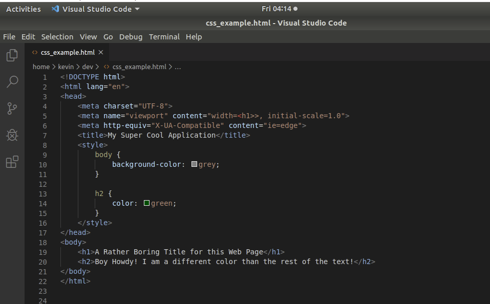
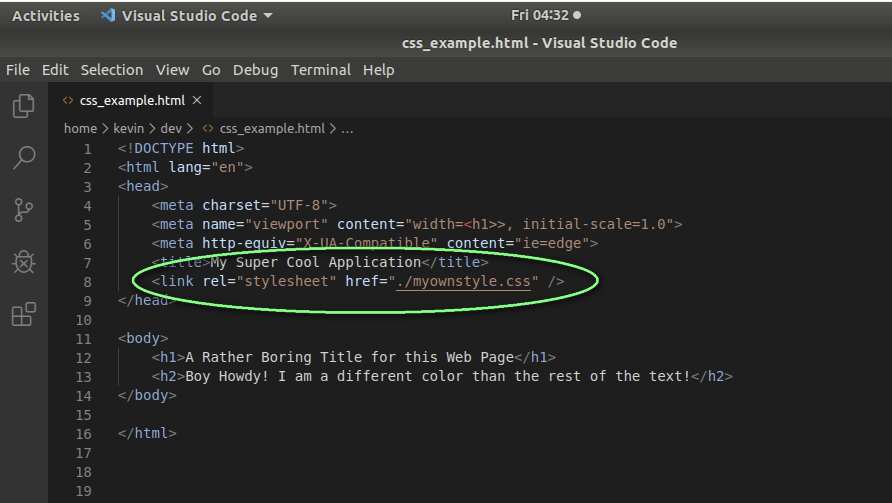

# Introduction to CSS

Cascading Style Sheets, or [CSS](https://en.wikipedia.org/wiki/Cascading_Style_Sheets), is a style sheet language used for describing the presentation of a document written in a markup language like HTML. CSS is a cornerstone technology of the World Wide Web, alongside [HTML and JavaScript](https://github.com/Kevin-CodeCrew/coding_concepts_sprint_2/blob/master/Introduction_to_HTML.md#html-concepts).

While technically you can style your HTML *inline* using the `style` attribute, in actual practice you should **always** separate the content (HTML) and the styling that will determine how it appears in the browser. By doing so you can easily change the look and feel of your entire web site on the fly simply by using a different style sheet file.

If you have ever selected a *theme* for your operating system, web browser, or other program then you understand the power of external styling of content.

## Using CSS in your own HTML Pages
So how do we *apply* a stylesheet to the HTML or application produces? By using the `style` HTML element. HTML supports the `style` element in order for you to include styling information in the HTML generated by your application and you can use it in 2 different ways.

### Inline Styling and CSS
You can specify your styling *inline*. The word *inline* just means that you literally type the setting inside of an HTML element. 

`<h1 style="color:blue;">This is a Blue Heading</h1>`

This is a **VERY BAD** idea. As you can imagine, any time you want to change how the element is displayed in the web browser, you would have to manually go and find every reference (which may be in several HTML pages) and make the change. Instead, using CSS is the way to go.

Using CSS, you can specify all of your styling for your web site in a single place. However, HTML also allows CSS to be declared *inline* with a slightly different syntax. Simply change the style *in one place* and it takes affect on any and all web pages that include the CSS.

If styling via *inline* `<style>` elements, you always want to declare the styles in the *HEAD* portion of the HTML so that the styling information (colors, backgrounds, etc.) are already loaded and available before the web browser renders the *BODY* of the HTML.

While this is convenient, it is **A BAD IDEA** because then you are cursing your HTML content to always look the same because you are [hard coding](https://en.wikipedia.org/wiki/Hard_coding) what the web page will look like which makes it very difficult to maintain/keep current. 

### External CSS
Instead the best option is to put all of your styling in a separate CSS file that then can be pulled in or *included* in all the HTML web content for your site. 

### Selectors
### Properties
### Values

## Working With CSS Selectors
### Type Selectors
### Class Selectors
### ID Selectors
### Other Selectors

# Additional Information
[CSS BEM](https://css-tricks.com/bem-101/)

