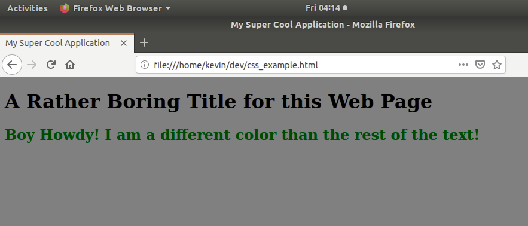
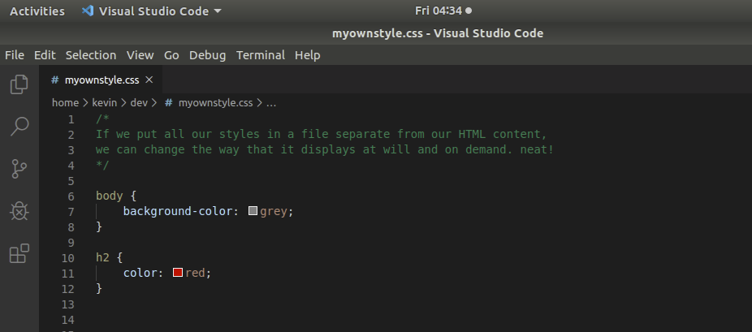
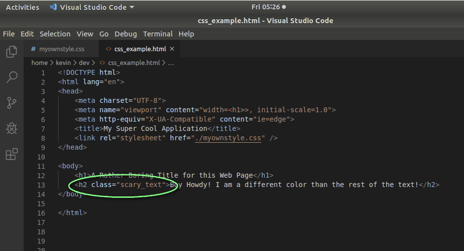
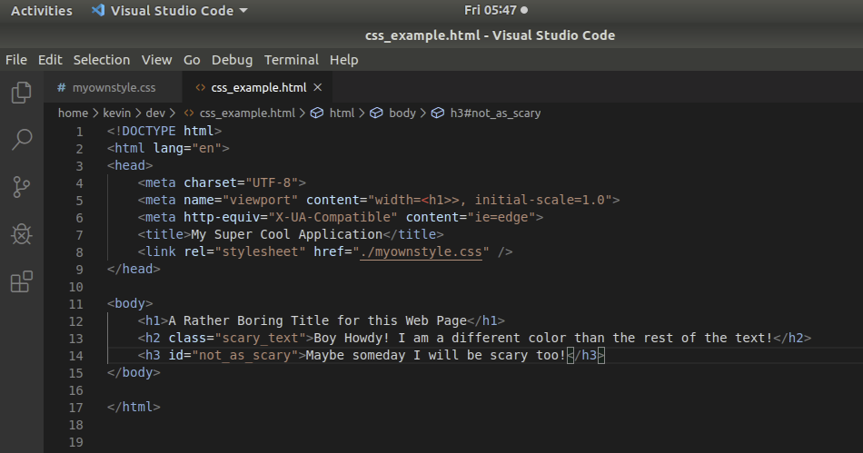
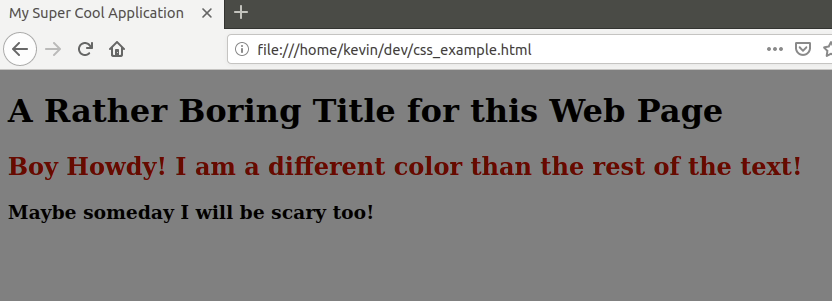

# Introduction to CSS

Cascading Style Sheets, or [CSS](https://en.wikipedia.org/wiki/Cascading_Style_Sheets), is a style sheet language used for describing the presentation of a document written in a markup language like HTML. CSS is a cornerstone technology of the World Wide Web, alongside [HTML and JavaScript](https://github.com/Kevin-CodeCrew/coding_concepts_sprint_2/blob/master/Introduction_to_HTML.md#html-concepts).

While technically you can style your HTML *inline* using the `style` attribute, in actual practice you should **always** separate the content (HTML) and the styling that will determine how it appears in the browser. By doing so you can easily change the look and feel of your entire web site on the fly simply by using a different style sheet file.

If you have ever selected a *theme* for your operating system, web browser, or other program then you understand the power of external styling of content.

## Using CSS in your own HTML Pages
So how do we *apply* a stylesheet to the HTML or application produces? By using the `style` HTML element. HTML supports the `style` element in order for you to include styling information in the HTML generated by your application and you can use it in 2 different ways.

### Inline Styling and CSS
You can specify your styling *inline*. The word *inline* just means that you literally type the setting inside of an HTML element. 

`<h1 style="color:blue;">This is a Blue Heading</h1>`

This is a **VERY BAD** idea. As you can imagine, any time you want to change how the element is displayed in the web browser, you would have to manually go and find every reference (which may be in several HTML pages) and make the change. Instead, using CSS is the way to go.

Using CSS, you can specify all of your styling for your web site in a single place. However, HTML also allows CSS to be declared *inline* with a slightly different syntax. Simply change the style *in one place* and it takes affect on any and all web pages that include the CSS.

If styling via *inline* `<style>` elements, you always want to declare the styles in the *HEAD* portion of the HTML so that the styling information (colors, backgrounds, etc.) are already loaded and available before the web browser renders the *BODY* of the HTML.




While this is convenient, it is **A BAD IDEA** because then you are cursing your HTML content to always look the same because you are [hard coding](https://en.wikipedia.org/wiki/Hard_coding) what the web page will look like which makes it very difficult to maintain/keep current. 

### External CSS
Instead the best option is to put all of your styling in a separate CSS file that then can be pulled in or *included* in all the HTML web content for your site. 




Now you can simply change one CSS file and change the look and feel of your **entire site** without touching a single line of our HTML!

### CSS Syntax
CSS definitions consist of 2 things:
1. Selector - The selector is the match pattern that determines for which HTML elements the style definition will take affect.
1. Properties/Values - There are many ways you can change the appearance of elements using CSS. You do so by specifying the characteristic or *property* of the content you wish to change, along with the new values. Like setting the text color to blue.

#### CSS Properties

#### CSS Property Values

## Working With CSS Selectors
So then how do we specify exactly which HTML elements we want to change the color for or similar? We *select* them by specifying a matching selector/matching pattern in our CSS file. These are called *[CSS selectors](https://en.wikipedia.org/wiki/Cascading_Style_Sheets#Selector)*.

### Type Selectors
*Type* selectors are the broadest form for selecting multiple HTML elements, and are the least used. Type selectors select **all** HTML elements of a specified type, and applies the corresponding style(s) from your style sheet in CSS. For type selectors, you simply specify the name of the HTML element(s) without the brackets.

For example, the selector below will select **all** `H2` elements in the HTML document and will change the color of the text to red.

```
h2 {
    color: red;
}
```
### Class Selectors
*Class* selectors allow you to group many HTML elements and reference them all by their class name [attribute](./Introduction_to_HTML.md#attributes). You can optionally specify a class as an attribute to any HTML element(s).

 

> **NOTE** that there is no `.` in front of the class name in your HTML element

To specify a class selector in your CSS file(s) you do so by preceeding the class name with a `.` (period/dot).


> **NOTE** that there **IS** a `.` in front of the class name in your CSS

### ID Selectors
Each HTML element may be assigned an optional [ID](./Introduction_to_HTML.md#attributes). This ID value **must** be unique in the rendered HTML document. ID attributes are used when you want to *specifically target a single HTML element*. The selector in the CSS is specified by a hashtag (#) and the ID name.


Then in your HTML content



Once the CSS is applied/included to/in your HTML your page goes from this...



to this!


#### BEM Naming of HTML Elements
### Other Selectors

# Additional Information
[CSS BEM](https://css-tricks.com/bem-101/)

